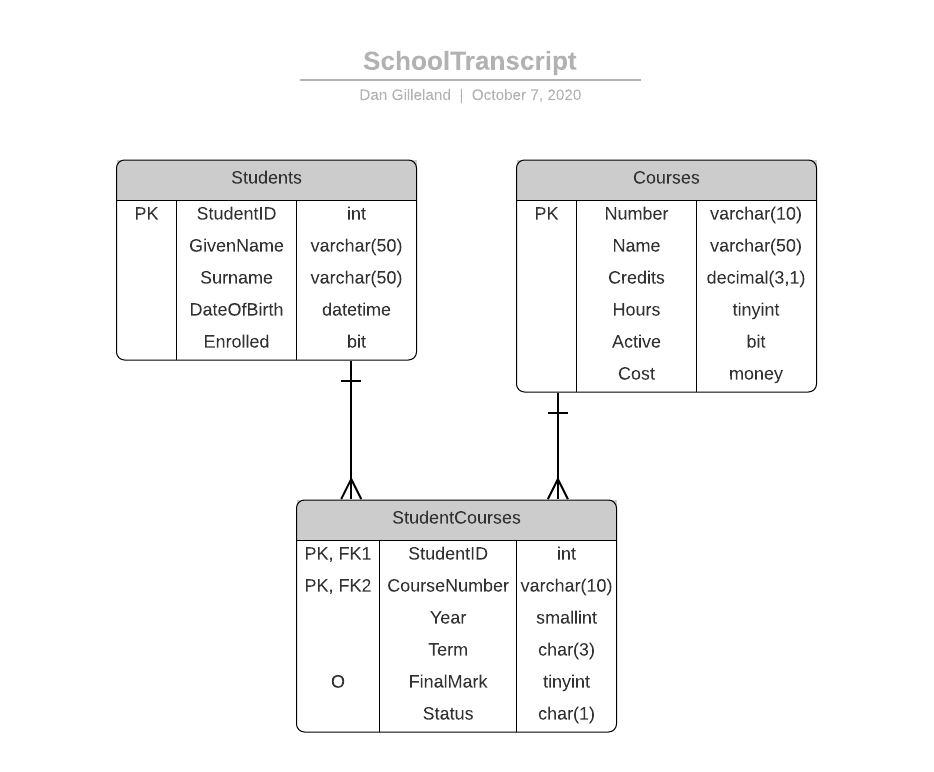
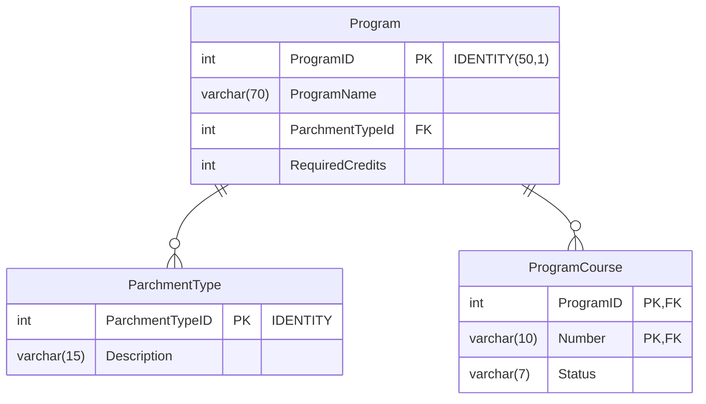

# School Transcript

> A database is needed to manage student enrollment in courses for a new school. Write the DDL statements to create/maintain this database.

## *V.1.0.0* -  Initial Design

We're in a hurry to get the [**School Transcript**](./SchoolTranscript.V.1.0.0.sql) database set up so that we can begin to accept registrations for courses that start this coming fall. Use the following physical ERD to generate your database tables. Unless otherwise specified by the ERD, all columns are required (*i.e.: `NOT NULL`*).



The following constraints/identities must be applied to the database. Refer to the page on [**Check Constraints**](CHECK-Constraints.md) for the related grammar and operators.

- [ ] **`Student`** table
  - [ ] `StudentID` is an Identity with a seed of 20250001 and an increment of 3
  - [ ] `GivenName` and `Surname` have a minimum length of 2
  - [ ] `DateOfBirth` must be in the past (less than today's date)
  - [ ] `Enrolled` is "true" by default
- [ ] **`Courses`** table
  - [ ] `Number` must follow the pattern of `[a-z][a-z][a-z][a-z][- ][1-9][0-9][0-9][0-9]%`
  - [ ] `Name` must have a minimum of 5 characters
  - [ ] `Credits` can only be 3.0, 4.5, or 6.0
  - [ ] `Hours` can only be 60, 75, 90, or 120
  - [ ] `Active` is "true" by default
  - [ ] `Cost` cannot be negative
- [ ] **`StudentCourses`** table
  - [ ] `Year` must be between 2000 and 2299
  - [ ] `Term` must be either "SEP", "JAN" or "MAY"
  - [ ] `FinalMark` must be between 0 and 100
  - [ ] `Status` must be either 'W', 'E', or 'A' (Withdrawal, Enrolled, or Audit) and must default to 'E'

You have been supplied a [small file of test-data](./SchoolTranscriptTestData.1.0.0.sql) to check the results of your `CREATE TABLE` statements.

----

## *V.1.0.1* - Minor Changes

A number of minor changes have been requested for the structure of the existing tables. Create another script file (`SchoolTranscript.V.1.0.1.sql`) to contain the code required to *alter* the existing tables. Here are the list of changes.

- Modify the Students table to include an optional column for the `MiddleNames` (max of 75 characters)
- Also create a column named GPA that is a decimal(3,1).
- Double the size of the `Surname` column. This is to
better accommodate students with hypenated surnames.
- Add a column to the Courses table for the `Semester`. Store the Semester number as a `tinyint`. Allow it to be NULL. Also ensure that the values have to be between 1 and 4.
- We want to indicate if a course is available for "Open Studies". Open Studies courses are ones that Students can take without having to be enrolled in the entire Program of Studies. Use the column name `OpenStudies` and store the value as a `bit`.

In addition to the above changes, we want to have non-clustered indexes on all foreign keys in our tables.

----

## *V.1.0.2* - Required Data

The school now requires that all courses be assigned to a default semester. That means we will have to alter the table to make semester a required column.

Before we can do that, however, we need to make some changes to our existing database to bring all courses in-line with that requirement. Run the following to update the database and then write the `ALTER TABLE` that makes `Semester` required. Put all of this code in a new file named `SchoolTranscript.V.1.0.2.sql`.

```sql
/* Modifying the Courses data to fit a pattern for the semester*/
UPDATE  Courses
SET     Semester = 1
WHERE   [Number] LIKE '_____10%'

UPDATE  Courses
SET     Semester = 2
WHERE   [Number] LIKE '_____15%'

UPDATE  Courses
SET     Semester = 3
WHERE   [Number] LIKE '_____20%'

UPDATE  Courses
SET     Semester = 4
WHERE   [Number] LIKE '_____25%'
```

----

## *V.1.5.0* - Multiple Parchments

The school plans to offer multiple *Programs of Study*. A Program is a set of courses that will satisfy the requirements for a certain parchment type. We are planning to support *Certificate*, *Diploma* and *Degree* programs.

Use the following rough ERD as an extension to the existing database design. All columns are required. Place your code in a new file named `SchoolTranscript.V.1.0.0.sql`.



Once you have created the tables, run the attached [bulk insert](./SchoolTranscriptTestData.1.5.0.sql) to add the school's plans for upcoming programs of study.

> ***Instructor Note:** The test data purposely includes "bad" data, such as wrongly types status values and parchment descriptions. These will need to be "sanitized" at a later stage in this demo.*

----

## V.1.5.1 - Validations

Validations are required on the newly added tables. Apply the following constraints.

- The total number of credits required to graduate from a program must be between 60 and 240 (in order to accommodate the range of possible parchment types).
- The acceptable status values are "Active", "Retired", "Draft", and "Proposed".
- Unless otherwise specified, courses for new parchments will be set to *`'Proposed'`*.
- Parchment descriptions can only be "Diploma", "Certificate" or "Degree".

These constraints have to be applied even if existing data in the database does not match these rules.

----
